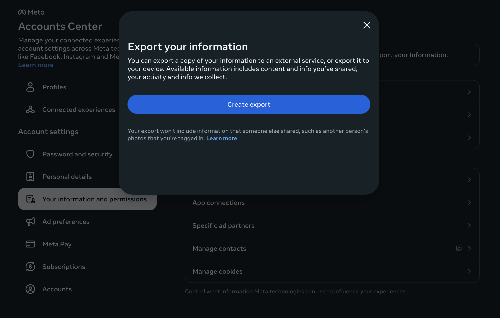
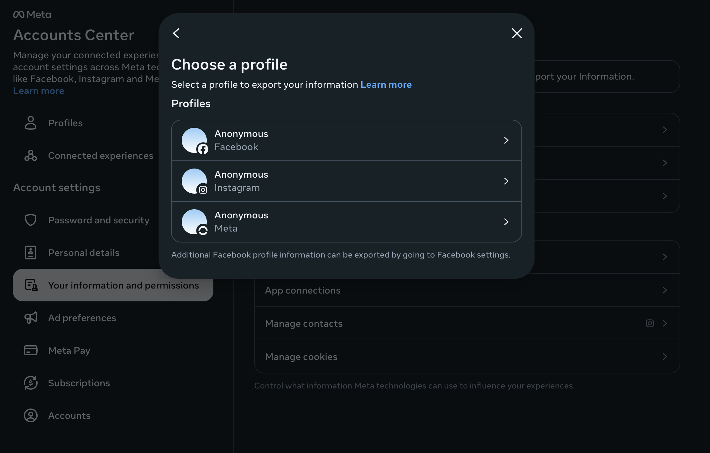
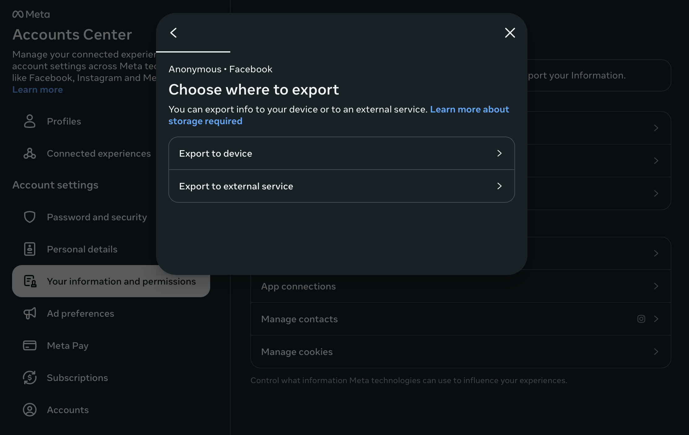
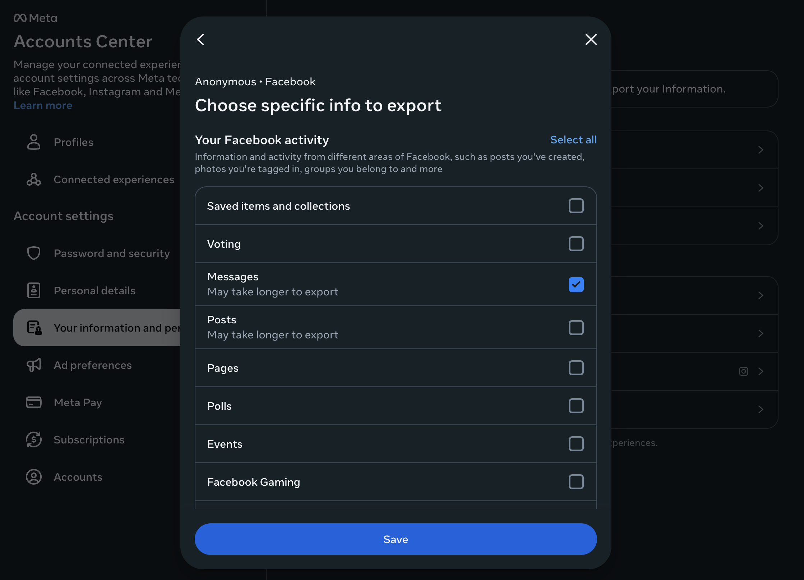
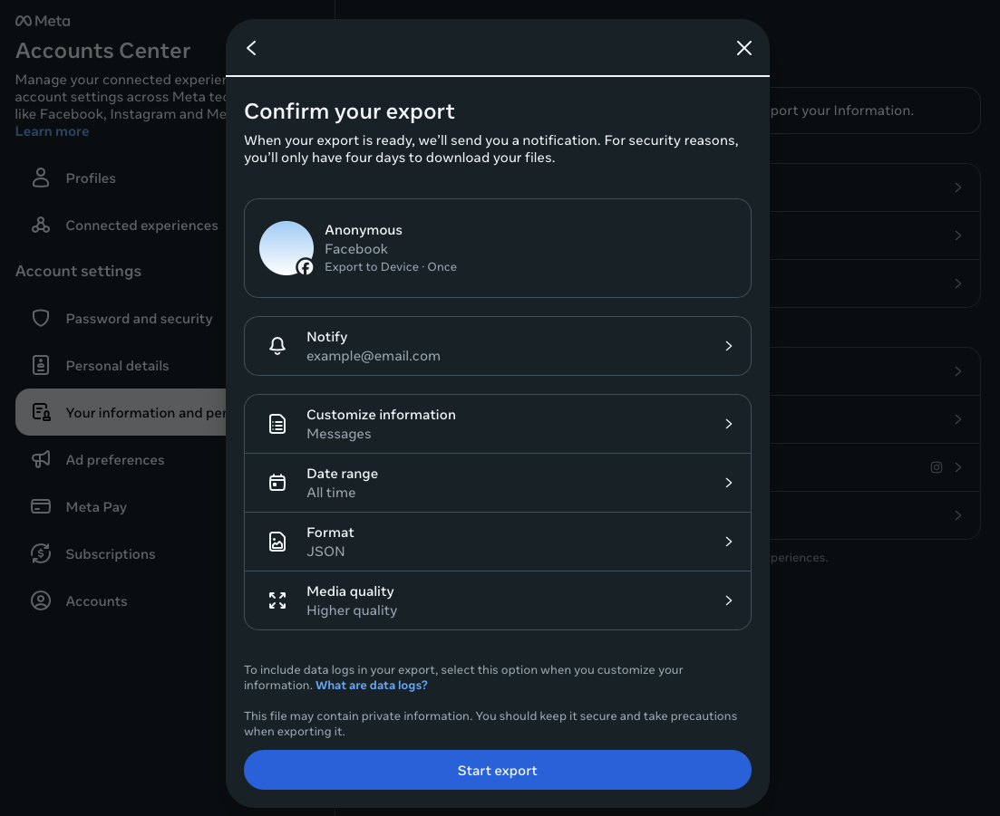
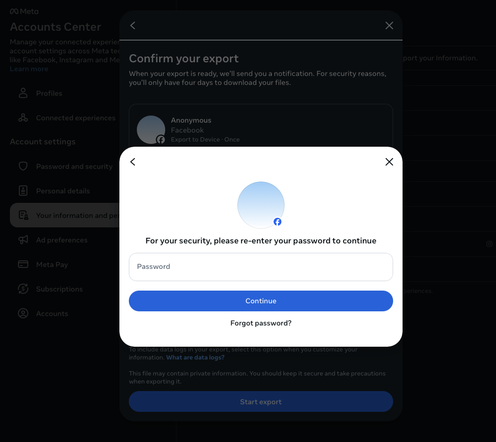

# ChatWrapped — User Guide

A simple guide to getting started with ChatWrapped: what it does, what you need, and how to get your Messenger data from Meta.

---

## What is ChatWrapped?

**ChatWrapped** is a desktop app that lets you browse, search, and explore your Meta/Facebook Messenger messages — all on your own computer. Your data never leaves your device. Everything runs locally: import, search, and browsing happen entirely on your machine.

### What you can do

- **Browse** your old conversations with infinite scroll, date picker, and a message histogram to jump to any date
- **View media** — photos, videos, audio, and files inline in the message view
- **Search** across all your messages or within specific chats
- **View reactions** — see who reacted and how
- **See stats** — conversation count, message count, word count on the Home page
- **Clear data** — remove all imported data from the Import page
- **Privacy-first** — no cloud, no uploads, no tracking

---

## What You Need

1. **A Meta (Facebook) account** with Messenger data
2. **ChatWrapped** — the desktop app ([download from GitHub Releases](https://github.com/pawarm/ChatWrapped/releases) or [build from source](https://github.com/pawarm/ChatWrapped#build-from-source))
3. **A Messenger data export** — a ZIP file from Meta (see below)

---

## How to Get Your Messenger Export

Meta lets you download a copy of your data. You request an export, and Meta prepares it (usually within 24–72 hours). Then you download a ZIP file and import it into ChatWrapped.

### Quick links

- **Meta Help:** [Export a copy of your Facebook information](https://www.facebook.com/help/212802592074644)
- **Export page:** [Download your information](https://accountscenter.facebook.com/info_and_permissions/dyi/)

---

## Step-by-Step: Requesting Your Export

Follow these steps in the Meta Accounts Center to get the ZIP file ChatWrapped needs.

### Step 1: Create export

1. Go to [Export your information](https://accountscenter.facebook.com/info_and_permissions/dyi/)
2. In **Your information and permissions**, find **Export your Information**
3. Click **Create export**

---

### Step 2: Choose a profile

4. Select which profile to export from.
5. For Messenger messages, choose **Facebook** (Messenger data is tied to your Facebook account).

---

### Step 3: Choose where to export

6. Choose **Export to device**.

---

### Step 4: Choose specific info to export

7. In the **Choose specific info to export** step, uncheck everything, scroll down to make sure everything is unchecked, then select **Messages**.
8. Click **Save**.

**Note:** Meta warns that Messages “may take longer to export” — this is normal. Large histories can take 24–72 hours.

---

### Step 5: Confirm your export settings

9. Review the summary: profile, export type, and selected data.
10. Set **Date range** to **All time** (or try the smaller range you want).
11. Set **Format** to **JSON** — ChatWrapped needs the JSON format.
12. Choose **Media quality** for photos and videos.

---

### Step 6: Confirm and start export

13. Click **Start export**.
14. Re-enter your password when asked (for security).
15. Click **Continue**.

Meta will notify you when the export is ready. You have **4 days** to download it after that. Download the ZIP file from the link they provide.

---

## After You Get the ZIP

1. Open **ChatWrapped**.
2. Go to the **Import** page.
3. Select or drag-and-drop your Messenger export ZIP file.
4. Wait for the import to finish.
5. Go to **Conversations** to browse and search your messages.
